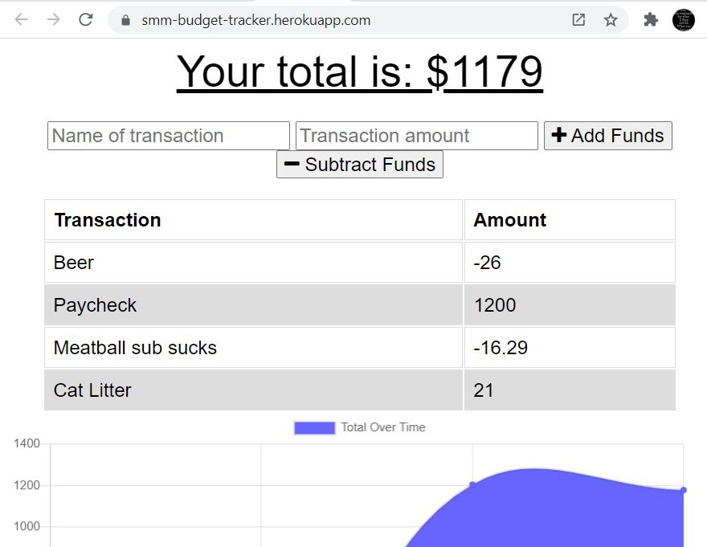

# Budget Tracker Progressive Web Application (PWA) 

## Table of Contents
1. [Description](#description)
2. [Technologies](#technologies)
3. [Deployed App](#installation)
4. [Usage](#usage)
5. [Tests](#tests)
6. [Questions](#questions)
7. [License](#license)

## Description
A full-stack budget-tracker application developed in Node.js and MongoDB, that allows users to:
* enter transactions online and update budget automatically
* cache transactions locally in indexedDB while offline
* upload offline transactions to mongoDB upon subsequet connection
* download a PWA version of the application

## Technologies/NPMs
1. [Compression](https://www.npmjs.com/package/compression) - optimize code for speed
2. [Express](https://www.npmjs.com/package/express) - to run our web server
3. [Lite-server](https://www.npmjs.com/package/lite-server) - to create fallback when route(s) not found.
4. [Mongoose](https://www.npmjs.com/package/mongoose) - to connect to database
5. [Morgan](https://www.npmjs.com/package/morgan) - middleware for HTTP request and error handling

## Deployed App

View the [Deployed Application](https://smm-budget-tracker.herokuapp.com/).

## Tests
No testing suite is designated at this time.

## Questions
Copyleft 2021 S.D. Mullaney 
 
        

## License
Distributed under a Creative Commons CC0 1.0 Universal license.